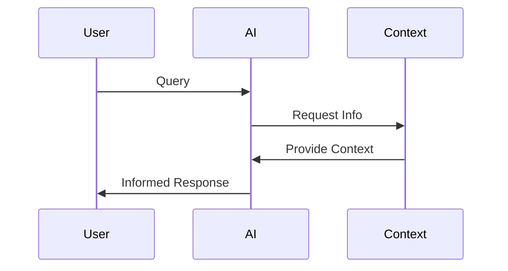

# Model Context Protocol (MCP)

Enabling AI models to dynamically request and receive context during inference

  
    Press Space for next page <carbon:arrow-right class="inline"/>
  

---
layout: default
---

# What is MCP?

<v-clicks>

- A protocol enabling AI models to dynamically request context
- Reduces need for upfront context provision
- Makes interactions more efficient and context-aware
- Improves token usage efficiency

</v-clicks>

---
layout: two-cols
---

# Dynamic Context

<v-clicks>

- Real-time context requests
- Query external knowledge bases
- Reduced token usage
- Improved efficiency
- Context-aware responses

</v-clicks>

::right::

---
layout: default
---

# Tool Integration

<v-clicks>

- Access to specialized databases
- Integration with external tools
- Expanded capabilities
- No direct integration needed
- Flexible architecture

</v-clicks>

---
layout: end
---

# Learn More

[Documentation](https://sensayhacks.com/prototypes/mcp) · [GitHub](https://github.com/davidorban/sensayhacks)
